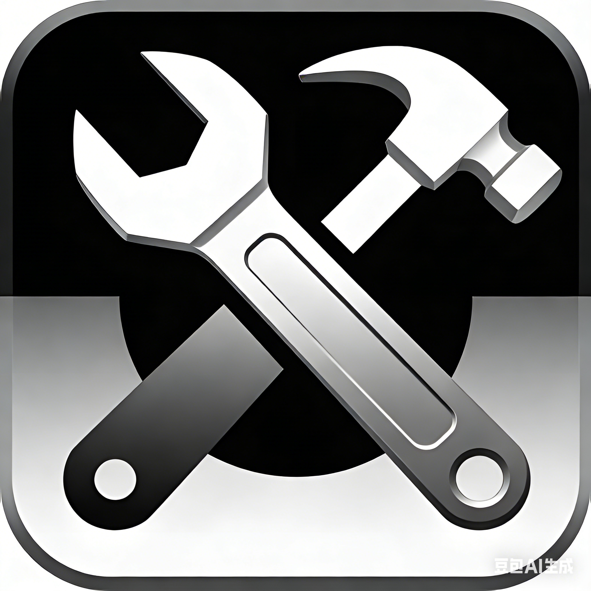

# DevTools

<p align="center">
  
</p>

<p align="center">
  <strong>A lightweight developer toolkit for daily development tasks</strong>
</p>

<p align="center">
  <a href="#features">Features</a> •
  <a href="#installation">Installation</a> •
  <a href="#usage">Usage</a> •
  <a href="#development">Development</a> •
  <a href="README_ZH.md">中文</a>
</p>

---

## Features

- **MD5 Hash Calculator** - Calculate 32-bit and 16-bit MD5 hashes (uppercase/lowercase)
- **Barcode Generator** - Generate CODE 128 barcodes
- **QR Code Generator** - Generate QR codes for text/URLs
- **Base64 ↔ Image** - Convert between Base64 strings and images
- **JSON Formatter** - Format, expand, and collapse JSON data
- **Handwritten Signature** - Draw signatures and convert to Base64 or save as images

## Installation

Download the latest release for your platform:

| Platform | Architecture | Download |
|----------|-------------|----------|
| Windows | x64 (64-bit) | `DevTools-win-x64.exe` |
| Windows | x86 (32-bit) | `DevTools-win-x86.exe` |
| Windows | ARM64 | `DevTools-win-arm64.exe` |

## Usage

1. Download the executable for your platform
2. Run `DevTools.exe` directly (no installation required)
3. Select a tool from the home screen

## Development

### Prerequisites

- .NET 8.0 SDK
- Windows OS

### Build

```bash
# Restore dependencies
dotnet restore

# Build
dotnet build

# Run
dotnet run

# Publish (self-contained single file)
dotnet publish -c Release -r win-x64 --self-contained true /p:PublishSingleFile=true
```

### Project Structure

```
DevTools/
├── Pages/              # Application pages
│   ├── HomePage.xaml
│   ├── Md5Page.xaml
│   ├── BarcodePage.xaml
│   ├── QrPage.xaml
│   ├── Base64ImagePage.xaml
│   ├── ImageToBase64Page.xaml
│   ├── JsonFormatPage.xaml
│   └── SignaturePage.xaml
├── Resources/          # Resources (images, strings, fonts)
│   ├── Images/
│   ├── Strings.resx
│   ├── Strings.zh-CN.resx
│   └── Strings.en-US.resx
├── Helpers/            # Utility classes
├── MainWindow.xaml     # Main window
└── App.xaml            # Application entry point
```

## Localization

The application supports multiple languages:
- English (en-US)
- 简体中文

The UI language automatically matches your system language.

## License

Apache License 2.0

## Changelog

See [CHANGELOG.md](CHANGELOG.md) for release history.
